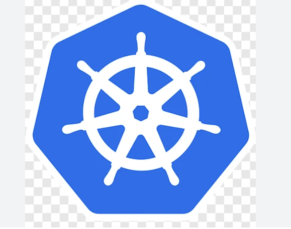

<html> 
<body>
    <head>What is Kubernetes ?</head>
 <h2>
Kubernetes, often abbreviated as K8s, is an open-source container orchestration platform that automates the deployment, scaling, and management of containerized applications. It was originally developed by Google and is now maintained by the Cloud Native Computing Foundation (CNCF).

Kubernetes provides a framework to run distributed systems resiliently, managing the life cycle of containers, handling networking, scaling, and storage needs, all while ensuring high availability and fault tolerance. It is widely used for container management in cloud-native applications.

Key features of Kubernetes include:

Automated Deployment and Scaling: Kubernetes automatically manages the deployment of containers, scaling them up or down as needed based on the demand.

Self-healing: If a container or pod fails, Kubernetes will automatically restart or replace it to maintain the desired state.

Load Balancing and Service Discovery: Kubernetes can automatically distribute traffic across containers, ensuring that no container is overloaded and that the service remains available.

Resource Management: It helps in efficient resource allocation by controlling CPU, memory, and storage use for containers.

Configuration Management: Kubernetes provides the ability to store and manage configuration files, secrets, and sensitive data like API keys.
</h2>

</body>
</html>